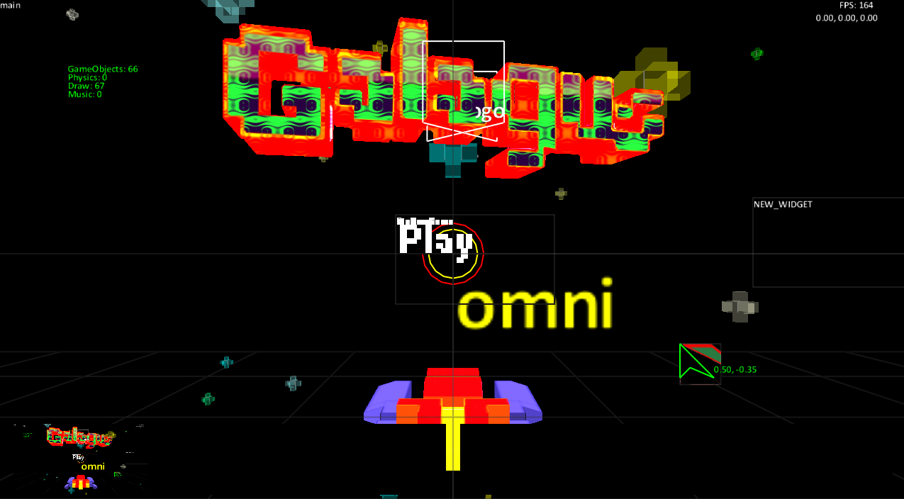

# GAME
_Great name..._


## What is this project?

1. A lightweight, simple framework for gamejamming indie 2D and 3D PC and VR games.
2. Well organised and easy to read and understand.
3. Focused on making games quicker to develop by using only in-engine tools and hotloading.

## What isn't this project?

1. A commercial or otherwise noteworthy game "engine".
2. Jam packed with the latest rendering techniques.
3. Specialised for any one particular type of game.

## Technology Choices

* SDL2 for IO and windowing
* OpenGL w/ GLSL 4.0 for rendering (glad loader)
* Lua 5.2 for scripting
* miniaudio for sound
* zlib for compression
* Remotery for profiling
* TGA, OBJ and FBX file formats
* For everything else, the choice is Roll-Your-Own because dependencies suck and this is a coding for fun and learning project.

## Platforms

The build system targets Windows, Linux and macOS using Bazel with platform-specific
dependency resolution. All third-party libraries live in `third_party/` and are compiled
from source or linked from vendored binaries as appropriate for each platform.

## Prerequisites

### All platforms

* **Bazelisk** - Bazel version manager (automatically downloads the correct Bazel version)
* **C++17 compiler**
* **OpenGL drivers** with GLSL 4.0 support

### Windows

* Visual Studio 2019 (or newer) with the **Desktop development with C++** workload
* Windows 10 SDK
* Install Bazelisk: `winget install Bazel.Bazelisk`

### Linux

* GCC or Clang with C++17 support
* System packages (Debian/Ubuntu):
  ```
  sudo apt install build-essential libsdl2-dev liblua5.2-dev libgl-dev zlib1g-dev
  ```
* Install Bazelisk: `npm install -g @bazel/bazelisk` or download from
  [GitHub releases](https://github.com/bazelbuild/bazelisk/releases)

### macOS

* Xcode Command Line Tools: `xcode-select --install`
* Homebrew packages:
  ```
  brew install sdl2 lua zlib
  ```
* Install Bazelisk: `brew install bazelisk`

## Building

Make an alias from bazelisk -> bazel if required, then build the game from the repository root:

```
bazel build //:game
```

Build configurations:

```
bazel build //:game --config=db Editor debug — loads loose files from source datapath, debug tools enabled
bazel build //:game --config=opt Editor release — loads loose files, debug tools stripped
bazel build //:game --config=datapack	Datapack release — loads from packed archive, fastest

```

The output binary is placed in `bazel-bin/`.

### Running

```
bazel run //:game
```

Or run the binary directly:

```
# Windows
bazel-bin/game.exe

# Linux / macOS
bazel-bin/game
```

The working directory must contain `game.cfg` and (optionally) the `datapack.dtz` data file.

### IDE Support (compile_commands.json)

For clangd-based code completion and navigation in VS Code, Vim, etc.:

```
bazel run //:refresh_compile_commands
```

This generates a `compile_commands.json` at the repository root.

## Debugging

### Windows (Visual Studio)

1. Build with debug symbols:
   ```
   bazel build //:game --config=dbg
   ```
2. Open Visual Studio (without a project/solution).
3. **Debug > Attach to Process** or **File > Open > Folder** and point to the repo root.
4. Alternatively, use **Debug > Other Debug Targets > Debug an Installed App Package** or
   launch the exe directly:
   ```
   devenv /debugexe bazel-bin/game.exe
   ```
5. Set breakpoints and debug as normal. Source files resolve from the workspace root.

### Windows (VS Code)

Add to `.vscode/launch.json`:
```json
{
  "version": "0.2.0",
  "configurations": [
    {
      "name": "Debug Game",
      "type": "cppvsdbg",
      "request": "launch",
      "program": "${workspaceFolder}/bazel-bin/game.exe",
      "cwd": "${workspaceFolder}",
      "symbolSearchPath": "${workspaceFolder}/bazel-bin"
    }
  ]
}
```

### Linux / macOS (GDB / LLDB)

```
bazel build //:game --config=dbg
gdb ./bazel-bin/game        # or: lldb ./bazel-bin/game
```

Or use the VS Code **CodeLLDB** / **C/C++** extension with a launch configuration pointing
at `bazel-bin/game`.

### Profiling with Remotery

While the game is running, open `third_party/remotery/vis/index.html` in a browser to
view real-time CPU profiling data.

## Project Organisation

`core/`
Code for atomic data structures, collections and containers. Anything that exists here does not need to include any other file in the solution, generally. Most of the code here should be declarative, not procedural (very little .cpp expected).

`engine/`
Functions required by the engine to perform the basic tasks of running a game - processing inputs, rendering things to the screen, loading resources and the like. Nothing feature specific to reside here.

`./`
Game specific functionality. Code here is glue that links engine features to perform compound tasks like controlling an AI agent or responding to player actions.

`third_party/`
Vendored third-party libraries and their Bazel BUILD files. Each subdirectory is a self-contained dependency.

## Controls

Key | Action
---|---
TAB | Switch to in-game editor (keys below work inside the editor)
Esc | Release the mouse
Left click | Select GUI element or GameObject
Right click | Open context sensitive menu (change object, new object etc)
w, a, s, d | Move debug camera in worldspace, shift modifier for rotation
x, y, z | Hold to reposition object, alt modifier rotates
p | Toggle script updates
F5 | Reload all scripts

## Code Style

```cpp
#include <cstandardthings>

#include <librarythings>

#include "core/Foo.h"
#include "core/Bar.h"

#include "engine/AnotherThing.h"
#include "engine/EngineThing.h"

#include "ThisFilesHeader.h"

bool Style::WhatIsYourStyle(bool a_tellMeNow, float & a_howManyTimes_OUT)
{
  // Here we are explaining why this is happening, verbose comments
  // are super nice. Comment lines don't cost anything and we are learning.
  if (a_tellMeNow)
  {
    a_howManyTimes += s_howManyTimeIncrement;
  }

  // We update our cached style version here
  m_styleDirty &= a_tellMeNow;

  return !a_tellMeNow && a_howManyTimes_OUT > s_howManyTimesThreshold;
}
```

### Variable naming

Prefix | Meaning
---|---
`m_variable` | Member variable
`a_variable` | Function argument
`s_variable` | Static / const / constexpr data member
`variable` | Locally scoped
`a_variable_OUT` | Mutable reference argument (output parameter)

### Coordinate systems

* **3D:** Z axis is UP, 1 unit = 1 metre
* **2D:** Screen centre is (0, 0), top-left is (-1, 1). 2D quads are drawn top-left to bottom-right.
